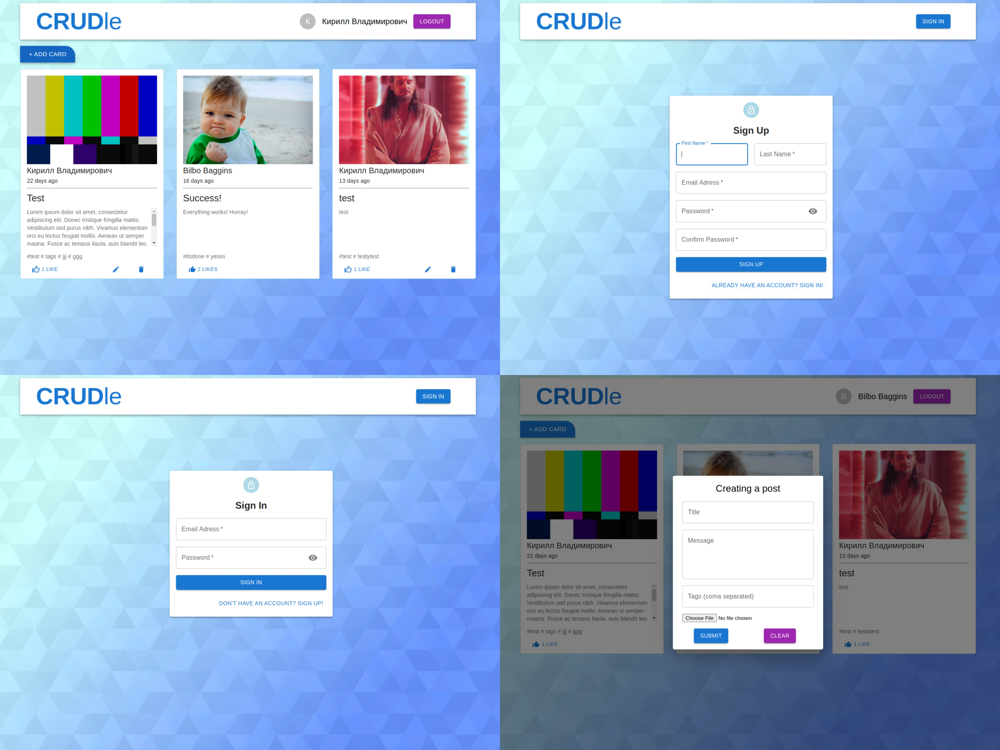

### Small "fullstack" project for practice
React + MUI, Express, MongoDB

#### Implemented features:
- Cards with picture (stored as base64), title, textfield, datefield, tags, like and edit/delete buttons
- Basic CRUD operations with 'cards'
- Registration/authentication
- CRUD operations are locked for unauthorized users
- Posts are tied to creator (Only creator can edit/delete it)

##### App is to trivial for deploy, so here's some screenshots:

